# Blockchain-Based-Property-Registration

<a href="LICENSE"></a>


## Land Registration using Blockchain
## Problem it Solves:
1. The elimination of middlemen: The elimination of middlemen or brokers makes the process of land registration less expensive. Brokers who try to defraud uninformed people will be unable to do so any longer. Brokers frequently take a long time to finish procedures, thus our project will help people save time.
3. A distributed tamper-proof ledger that prohibits ownership fraud.
4. IPFS is used to store important property registration papers in a secure manner.

## Technology Stack:
1. Ethereum Blockchain
2. Polygon/Matic
3. Web3Dart
4. IPFS
5. Flutter
6. Metamask

## Demo
Our Dapp is demonstrated in this video [here](https://youtu.be/0Coz_ivOaHs)

## Run Application on deployed website
Check out the deployed website [here](https://landregistry.live/)

https://landregistry.live/

This is for demonstration purposes only. With this key, you can log in as Land Inspector:
 <pre><b>6b86cddfedbec68ed2a1c7e14b993840a0848595ba5787aec9e8a38b18f0d96a</b></pre>
For user: <pre><b>3ed4aff1a8ff8e28df3cd307112f9166886edcc85a27136908e3b1687b111f89</b></pre>\
You can also use your own Ethereum wallet key as a user.

#### Check Smart contract At Ropsten Ethereum Testnet: [here](https://ropsten.etherscan.io/address/0x702058ba021cd4e4f847b40f32b58aa5be3a4661)

## To Run Application Locally
1. Clone the github repository and cd to the folder
2. Install the flutter 2.10.5, nodejs
3. Install ganache and truffle as shown below:
```
npm install -g truffle
```
4. Open Ganache and keep it running in the Background
5. Install the Metamask chrome extension, choose the local network and import the accounts
6. Compile and run our migrations from the command line as shown below:
```
truffle compile
truffle migrate
```
6 .Copy contract address as seen in the image below and paste in variable `contractAddress` located in the file `./lib/constant/constant.dart`
<pre>
2_deploy_migration.js
=====================

   Replacing 'Land'
   ----------------
   > transaction hash:    0x427b2b402f767ac6a90334ab3c687b086b274de747fe10d6e194743b15057d78
   > Blocks: 0            Seconds: 0
   <b>>contract address:    0xed690C24C60A48F8A9819c9A15AD75B70CFBEa5a</b>
   > block number:        3
   > block timestamp:     1650602828
   > account:             0x33e94e4619f0AecDf81e9676Eb82c109FBa53356
   > balance:             99.9154895
   > gas used:            3996227
   > gas price:           20 gwei
   > value sent:          0 ETH
   > total cost:          0.07992454 ETH
</pre>
7. In `constant.dart` file, change the value of the variable `chainId` to `'1337'` and change the value of the variable `rpcUrl` to `"http://127.0.0.1:7545"`
8. Run the flutter web app
```
flutter pub get

flutter run -d web-server --web-port 5555
```
9. Open the browser and the dapp will be running in http://localhost:5555/
10. Create mapbox api key from https://www.mapbox.com/ and Replace it with `mapBoxApiKey`in `constant.dart` file
11. Create nftstorage api key from https://nft.storage/ and replace it.
## Project Flowchart
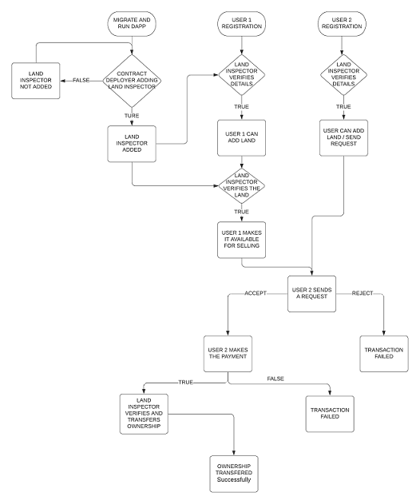

## Screenshots
Home Page                   |                   Wallet connect/Login
:---------------------------------:        |      :------------------------------:
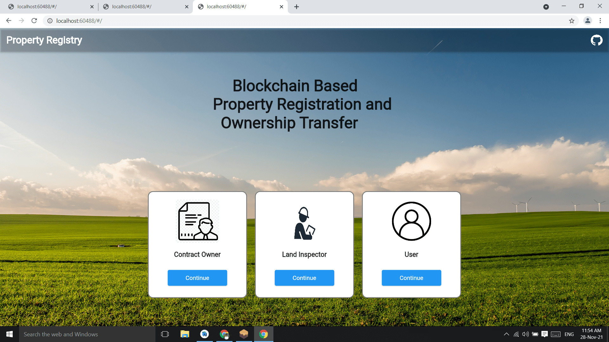  |

Contract Owner Dashboard               |                   User Registration
:---------------------------------:        |      :------------------------------:
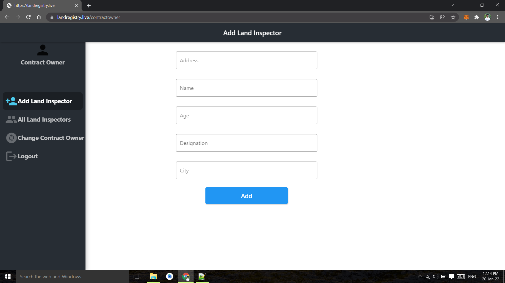  |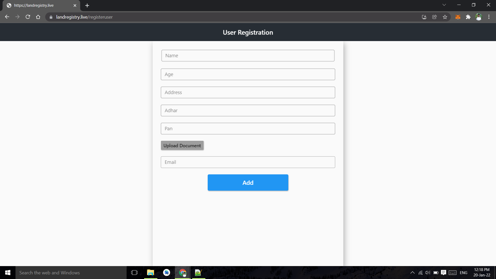

Land Inspector Dashboard                   |                  User Verification 
:---------------------------------:        |      :------------------------------:
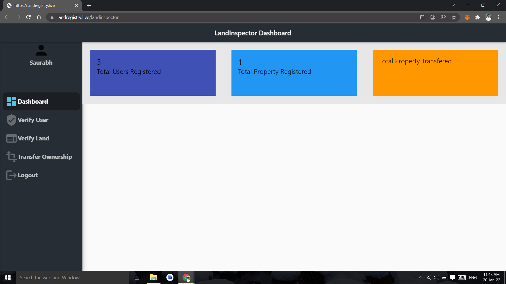     |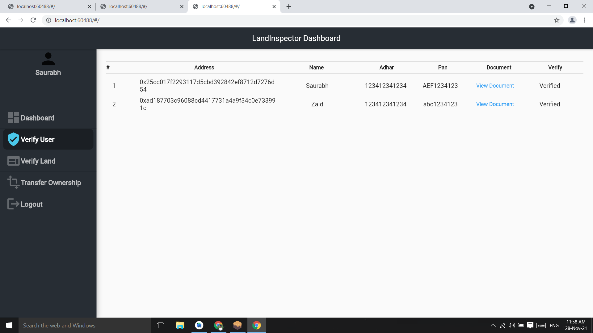

User Dashboard               |                  Adding land on Map    
:---------------------------------:        |      :------------------------------:
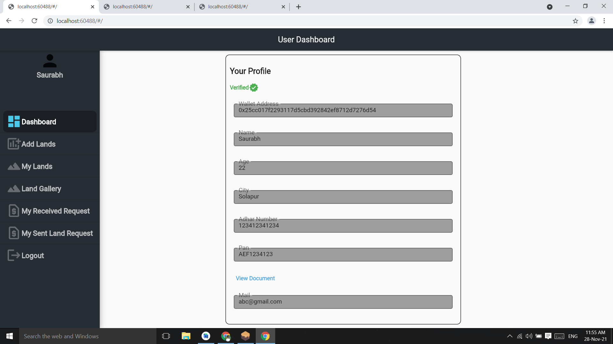     |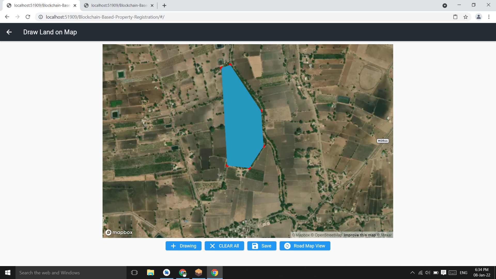

Land Gallery                |                   Land Details    
:---------------------------------:        |      :------------------------------:
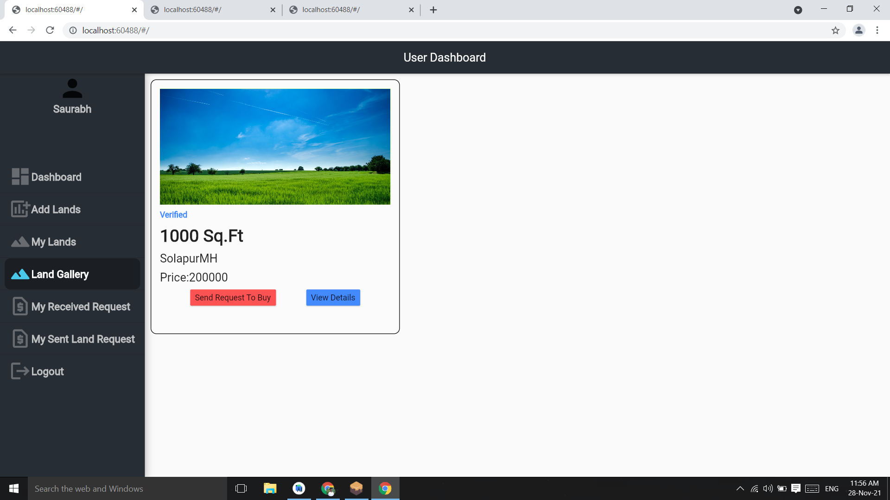     |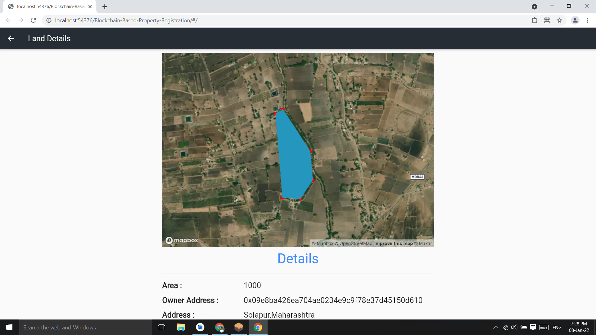

Received Request           |                   Make Payment  
:---------------------------------:        |      :------------------------------:
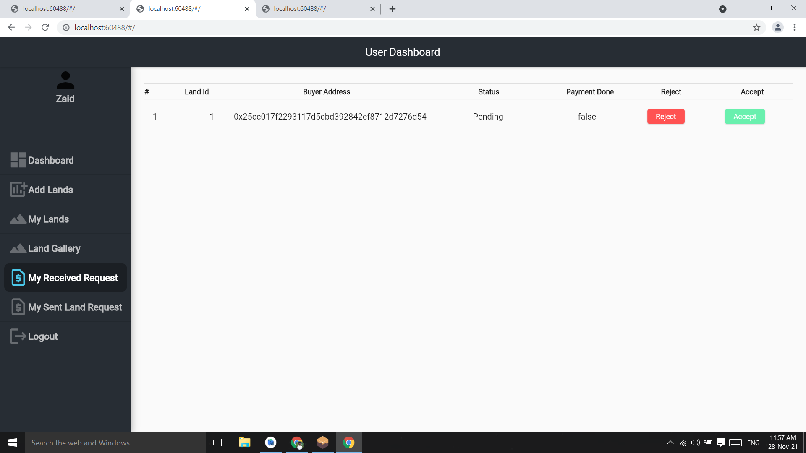     |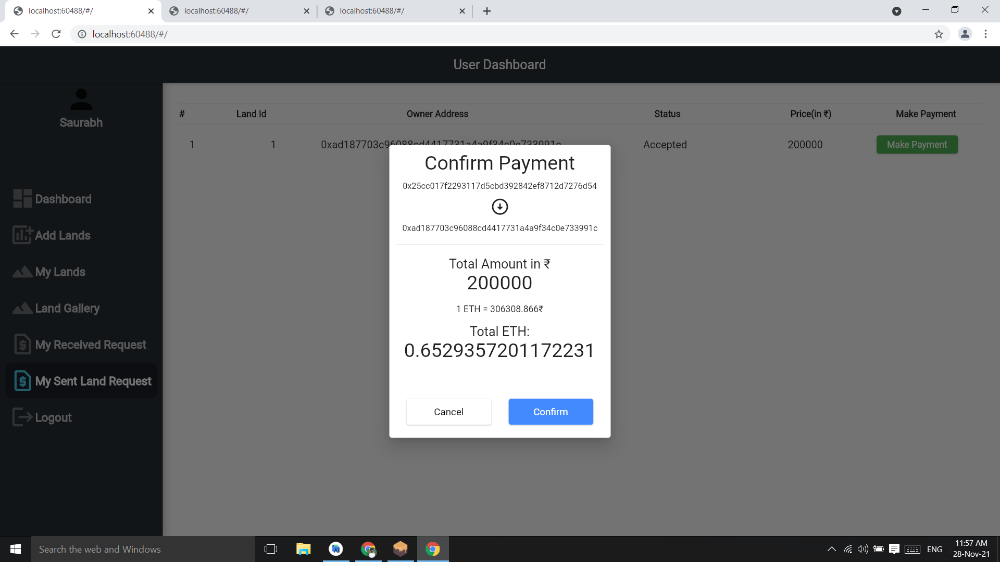

Transfer ownership,Seller,buyer photo capture   |                Witness info,photo capture,transfer ownership 
:---------------------------------:        |      :------------------------------:
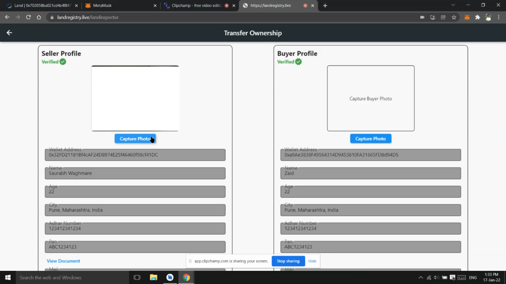     |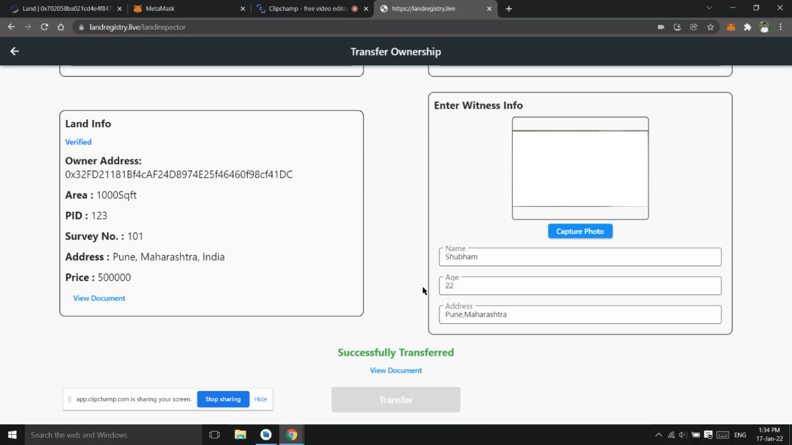
